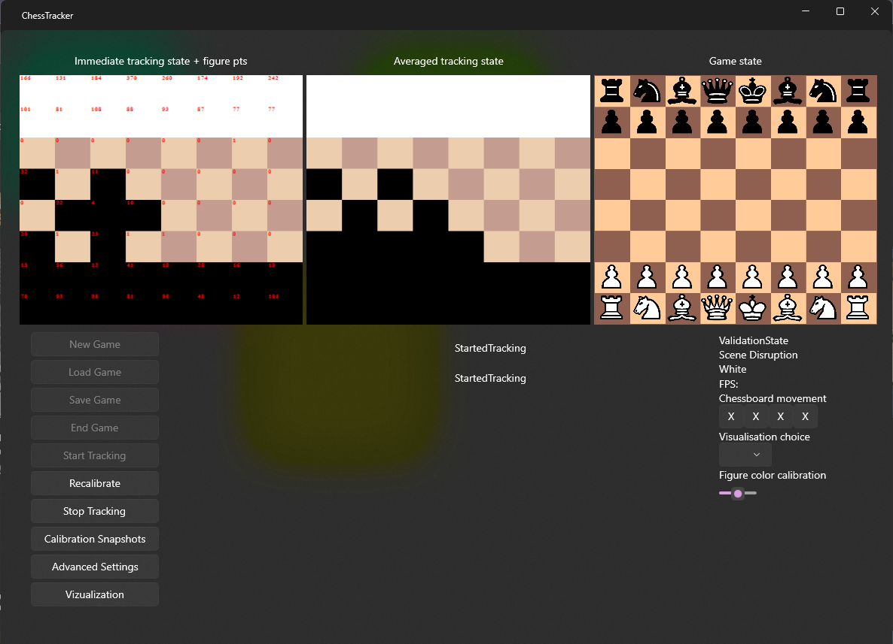
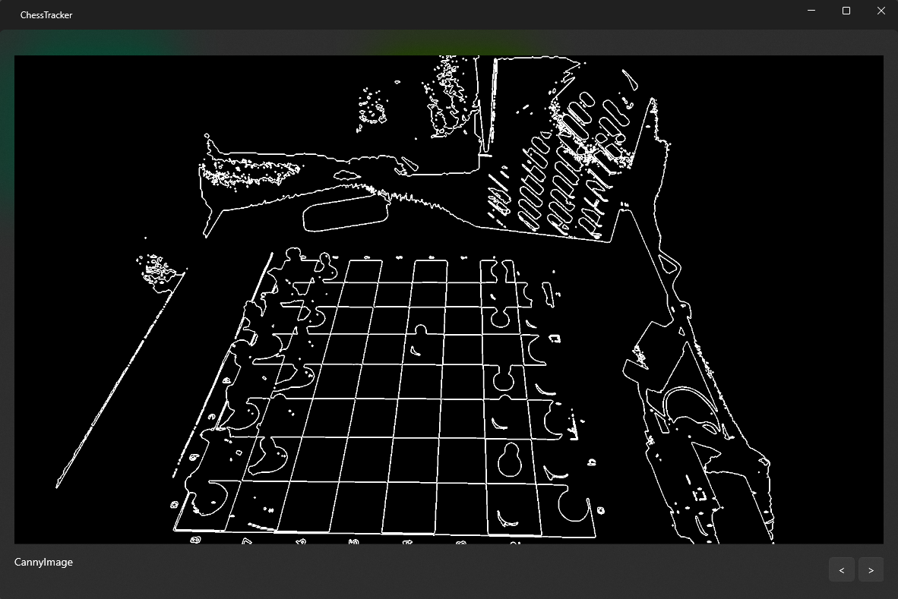
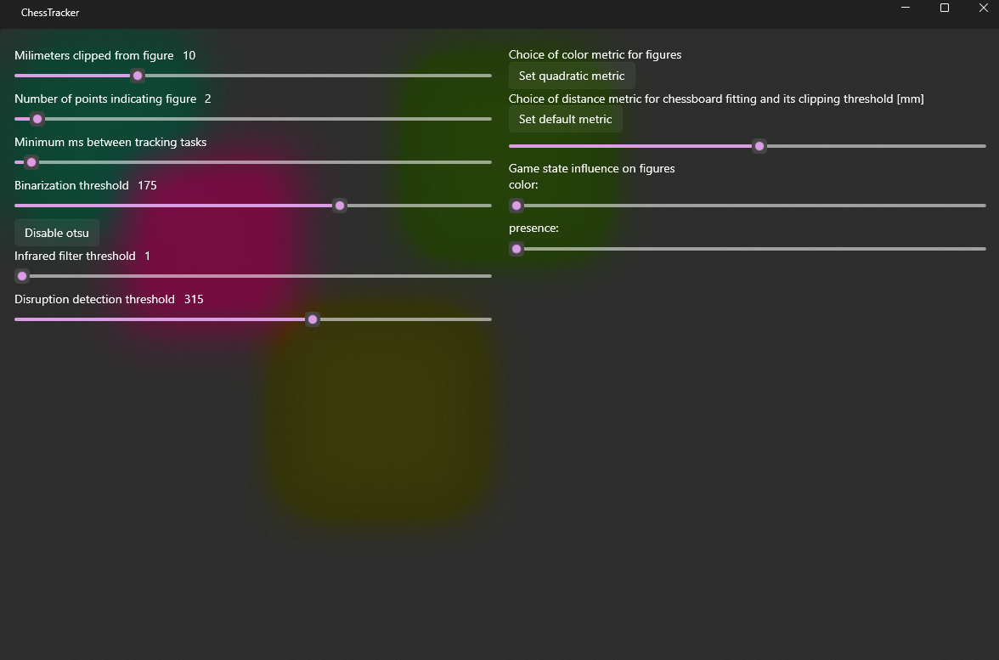

### Scene Preparation

The chess set suitable for tracking should have a minimum square size of 4.5+ cm on the chessboard and figures should be at least 2.5 cm tall for the smallest piece. If the chessboard is placed on a table, it should ideally be flat and single-colored, or not contain sharp color transitions, which worsen the determination of the board's position. The chessboard should be well-lit, ideally without sharp shadows from the pieces or other objects.

Aim the Kinect at the chessboard so that it monitors from approximately 45° from the board's normal. The angle is not strict, but at high values, there's a risk that pieces will obstruct each other, or the board might not be properly found. Conversely, at low values, the pieces may not be recognized well, or their colors might be misinterpreted due to reflections from lights. At angles close to zero, the sensor might be dazzled by its own infrared radiation emitter.

The distance of the sensor from the edge of the chessboard should be at least 50 cm, the upper limit for technical reasons is 4 meters, but for standard table chessboard sizes, the distance should not exceed 100-150 cm.

When setting up the sensor, it is also appropriate for it to cover the chessboard, or the plane it is laid on, as much as possible within the aforementioned recommendations.

### Operation

1. Open the ChessTracking.sln project located in the root directory of the source files in Visual Studio 2017.
   
2. Start the program using the keyboard shortcut Ctrl+F5, or from the top menu via Debug -> Start Without Debugging. Upon launch, two windows will appear: a control window and a visualization window.

3. By clicking on New game or Load game, you create a new game or load it from a file. The created game is displayed in the Game state image.

4. Ensure that the sensor is connected and powered.

5. Click Start tracking to begin monitoring. The initial detection of the chessboard can take 1-30 seconds. You can monitor its progress and result in the log. If it does not complete successfully, check the log for information on why the monitoring failed, or proceed according to the Troubleshooting chapter, specifically point 1.

6. After a successful search of the chessboard, the Immediate tracking state will change (shows the current state of the chessboard monitoring), Averaged tracking state (shows the averaged state of the chessboard monitoring), and in the visualization window, where you will see the colored output from the camera.

7. If the positions of the pieces in the scene are recognized in relation to the game state, it is announced in the log under the keyword "Game recognized". Also, all three images in the top row will be synchronized in terms of rotation. If the game is not recognized within a few seconds, proceed according to the Troubleshooting chapter, specifically points 2-4. If none of the points are applicable or functional, repeat the procedure from point 4 (now using Recalibrate instead of Start tracking), or you may try to slightly modify the real scene (different rotation of the chessboard, different angle of the sensor, etc.)

8. After locating the pieces, you can start playing. The game progress is recorded in the Record field. The Valid state rectangle turns red if the observed state of the chessboard in the scene differs from the current game state other than by a valid move. The Scene disrupted rectangle turns red if the player's hand moving the pieces is currently over the board, or if another disruption of the scene has occurred. In the event of a win or draw, this event is recorded in the log.

9. At any time, you can save the game from the beginning to the last valid move on disk using the Save game button.

10. The "Stop tracking" button can be used to end the monitoring of the game; the state of the game will be preserved in the last recorded valid move. For reinitiating monitoring, return to point 4.

11. The game can be deleted using the "End game" button. Loading a new game is described from point 3 onward.

### Description of the User Interface

The user interface is divided into 4 windows. The control window [image 1] and the visualization window [image 2] are open throughout the program's run. The control window contains the control buttons, log, settings, and progress of the chess game, while the visualization window is solely for displaying the camera's output.

Other windows that can be opened are advanced settings [image 3] and calibration snapshots [image 4]. In advanced settings, variables that affect the running of the program, especially the processing of the image, can be adjusted. The calibration snapshots show the state of bitmaps at various processing steps. These are suitable for debugging the Kinect's position, scene status, and variables.

The following section details the controls of each window.

### Control Window

New game button - creates a new game
Load game button - initiates a dialog box for loading a game from disk
Save game button - initiates a dialog box for saving the game to disk
Start tracking button - begins monitoring
Recalibrate button - resets monitoring
Stop tracking button - ends monitoring
Calibration snapshots button - opens a window with calibration snapshots

Advanced settings button - opens a window with advanced settings
Immediate tracking state image - displays the currently calculated positions of the pieces on the chessboard, and for each square, the number of points that are considered a piece
Averaged tracking state image - displays the averaged positions of the pieces on the chessboard
Game state image - shows the state of the game after the last valid move
Record field - contains the game log
Tracking log field - contains announcements regarding the monitoring state
Valid State rectangle - displays whether the currently observed state of the chessboard is valid relative to the game state
Scene disrupted rectangle - turns red if the currently observed scene is disrupted
"Currently moving" text - contains the color of the player whose turn it is
FPS text - displays the number of frames processed per second
Chessboard movement buttons - allow the user to move the assumed position of the chessboard by one square in all four directions
Visualization choice selector - affects the content displayed in the visualization window. Includes options:
RawRGB – color shot of the entire scene
MaskedColorImageOfTable – color shot of the observed table
HighlightedChessboard – color shot of the observed table with the chessboard highlighted - everything else is colored blue.

Figure color calibration slider - allows adjusting the color threshold for distinguishing pieces

### Visualization Window

Contains a visualization of the scene according to the choice in Visualization choice. If a game is currently recognized and being monitored, the image also includes black and white circles indicating the locations where the program sees the pieces.

### Calibration Snapshots

Show the state of bitmaps at various image processing steps. Buttons at the bottom right can switch between individual snapshots, and the text at the bottom left describes the currently viewed snapshot. Currently displayed snapshots are: color representation of the table and items on it, black and white representation of the table and items on it, a black and white snapshot after thresholding, and a thresholded snapshot after applying the Canny edge detector.

### Advanced Settings

1. Millimeters clipped from figure – sets the height up to which points are discarded when determining the (non-)presence of a piece on a square. The ideal state is clipping all points of the square and as few points from the piece as possible.

2. Number of points indicating figure – sets the minimum number of points above the square indicating the presence of a piece.

3. Minimum ms between tracking tasks – sets the minimum delay between the starts of individual scene state calculations. This can prevent undue processor load from continuous calculations, which ultimately do not provide additional important information.

4. Binarization threshold – a button used to turn adaptive thresholding on/off according to Otsu's method. If adaptive thresholding is turned off, a threshold adjustable by a slider is applied.

5. Choice of color metric for figures – switches methods for calculating the color of a piece. The original method calculates the luminance component of the image points of a piece, averages it across all points, and sets a threshold distinguishing black and white pieces. The setting of this threshold can be found in the control window. The method labeled as quadratic works similarly, but after calculating the luminance component, its value is modified by a quadratic function, which ultimately allows for easier finding of a suitable threshold.

6. Choice of distance metric for chessboard fitting and its clipping distance – switches methods for calculating the error between the chessboard model and real data when searching for the most suitable chessboard. The original method finds the closest point from the real data for each point in the chessboard model – if the distance between this pair of points is too great, it is clipped by a maximum value adjustable by a slider. The total error of the model is the sum of the distances for all points in the model. The method labeled as quadratic proceeds similarly, the difference being that the total error is not a sum of simple distances but their squares.

7. Game state influence on figures color/presence - moving these sliders to the right increases the influence of the current game state on the calculation of the color/presence of a piece. For example, if there is a black piece on a square, black color will be weighted more heavily in the calculation, likewise, if there is a piece on a square and the calculation is deciding whether it sees it or not, the variant that a piece is present on the square will more likely be chosen. This setting leads to more stable monitoring results if nothing is currently happening on the chessboard. Conversely, if a move has been made with the pieces, it may be harder to recognize their new position or color, as the calculation needs a stronger stimulus to recognize this change.

### Troubleshooting

##### 1. Chessboard Search Failed (Repeatedly)
After an unsuccessful search for the chessboard, open the calibration snapshots window by pressing the "Calibration snapshots" button in the control window. Use the arrows to find the color image of the discovered table—if this image does not match reality, meaning there is no table with the chessboard we want to monitor, then we may repeat the search or adjust the sensor's position and angle, or modify the real scene. If the table is found correctly, click through to the thresholded scene image. Check if it visually corresponds to image 3, meaning significant features of the chessboard (squares, pieces) are distinguishable both from each other and from the surrounding environment. Ideally, the scene should also not contain much noise information, such as inscriptions, areas spontaneously alternating black and white colors, etc. If the image is not suitable, we can try to adjust it in advanced settings by turning on/off the adaptive thresholding method, adjusting the threshold for color differentiation, and then repeating the chessboard search with these settings.

##### 2. Chessboard Search Completed, but Game State Does Not Match Monitored State in Colors or Rotation of Pieces
If the images differ in the color of the pieces or the rotation of the chessboard, manually set the color threshold using the "Figure color calibration" slider. If this cannot be done, try changing the metric for calculating color in the advanced settings and move the slider again. If it is still not possible to tune the correct threshold for differentiation, the lighting conditions of the scene need to be adjusted—the scene should ideally have a single light source, and no significant shadows should be cast on the chessboard.

##### 3. Chessboard Search Completed, but Game State Does Not Match Monitored State in Position of Pieces by Shift or Rotation
If the images differ in the position of the pieces or the rotation of the chessboard, select "HighlightedChessboard" in the "Visualisation choice" and check in the visualization window whether the table with the chessboard is displayed and everything, except the chessboard and the pieces on it, is colored blue. If this is not the case, either press "Recalibrate" to reset the search for the chessboard (i.e., return to step 5 in the "Operation" chapter), or use the "Chessboard movement" buttons to correctly position the chessboard.

##### 4. Chessboard Search Completed, Colors and Positions of Pieces are Reasonably Correct Except for Rotation (Points 2 and 3), but the Program Recognizes Empty Squares as Pieces or Fails to Detect Presence of Lower Pieces
The program likely has trouble distinguishing the points of a square from the points of a piece or is clipping too many image points from low pieces. Settings that may influence this can be found in the advanced settings under "Millimeters clipped from figure" and "Number of points indicating figure."

##### 5. Chessboard Search Completed, Detected Pieces' Dots Appear in the Visualization Window, but Nothing is Displayed in the Immediate or Averaged Windows, or the State of These Windows Remains the Same
Check if the "Scene disrupted" rectangle is red. If it is red, the program thinks the scene is disrupted and thus does not send any information about the state of the pieces in the scene. Please repeat the chessboard search process, or try to remove objects from the scene that are located above the chessboard and could potentially disrupt it.

##### 6. Game from File Did Not Load
Please check the log for a possible description of the error. The file likely contains invalid notation, or the program cannot simulate it.

##### 7. Program Has Trouble Detecting All Pieces, or Selectively Pieces of One Color
The pieces might be too small for the program to recognize—the ideal size is 2.5 cm and higher. There may also be a problem with the surface of the pieces, such as if the black pieces are black and glossy, there is a possibility that they do not reflect enough infrared radiation to be successfully recognized by the sensor at the current resolution of the image and the algorithms used. This can be verified by looking at the bitmap of reflected infrared radiation from the scene. If the pieces are completely dark on it, they probably return very little light, which is insufficient for accurately determining distance. The bitmap of infrared radiation can be found, for example, in sample applications of the sensor, which can be installed along with the drivers (SDK browser).

##### 8. Non-standard/Unexpected/Undescribed Course of Program
Save the possibly ongoing game and try turning the program off and back on.