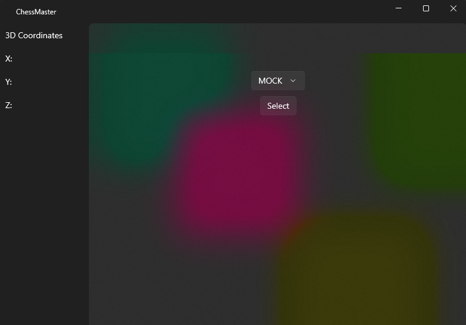
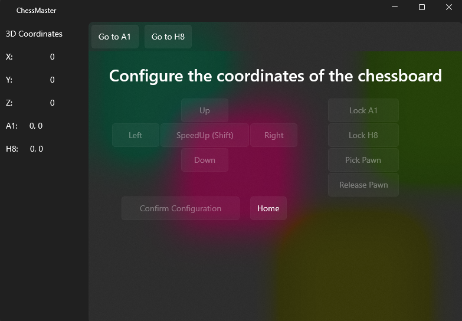
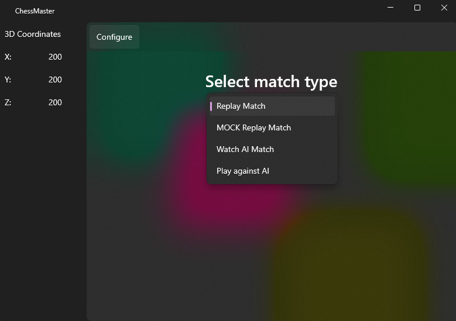
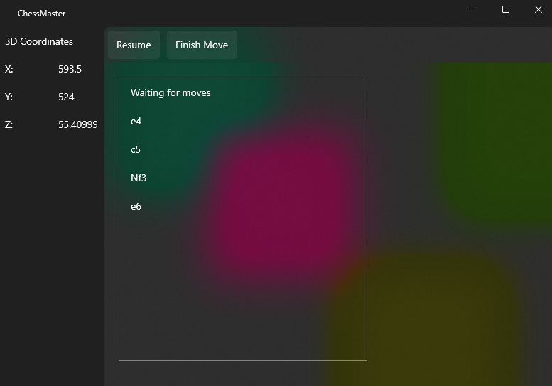
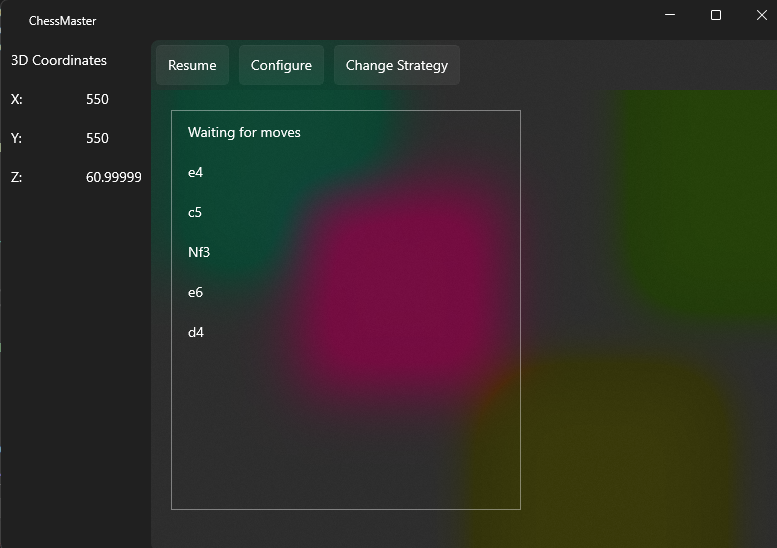
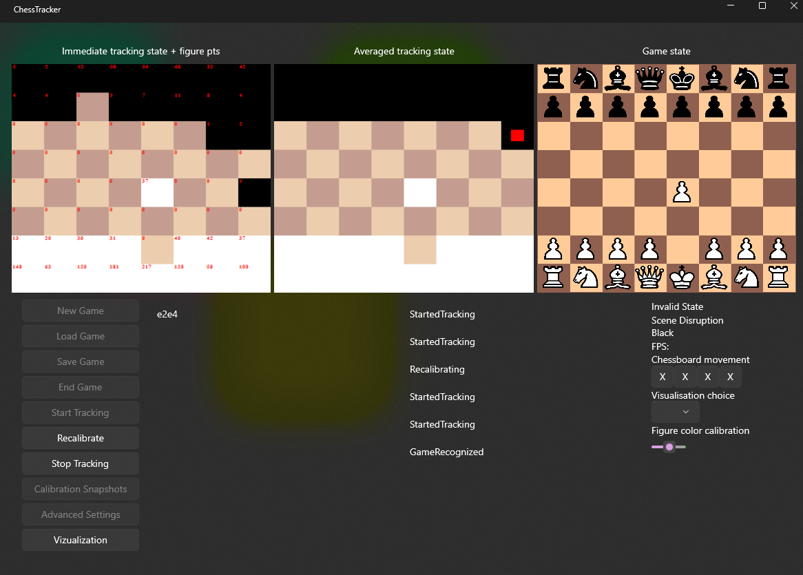

# Chess Master

This project contains a WinUI3 control application for robotic chess manipulator with purpose of playing chess.

## Description

Depending on the configuration, this application lets the robot play chess against a human player. Such a configuration requires KinectV2 and Stockfish, the chess engine, to be installed. The Stockfish exe application can be placed anywhere in the file system, and the application dialog will require the user to pick the file using a file picker.

Other configurations include Stockfish playing against another instance of Stockfish, which requires the same file as explained above.
The last configuration available is replaying a record of a game. This approach requires a .txt file with a chess record recorded in PGN chess notation.

## Dependencies

Windows 10 (or later)
.NET Desktop Runtime
.NET Framework v4.8
.NET 7 sdk
Kinect for Windows SDK 2.0
Windows App SDK
Stockfish.exe
Visual Studio 2019 16.11 (or later) or Visual Studio 2022 17.0 Preview (or later)

Kinect v2

## Hardware requirements

64-bit (x64) CPU
4 GB RAM (or more)
Dual-core 3.1 GHz (2 logical cores per 1 physical) (or better)
USB 3.0 controller dedicateed for Kinect v2 sensor
Graphical adapter supporting DX11
Kinect v2 sensor, connecting hub and usb cabel
Custom robotic manipulator supporting G-code

## Installation

1. Install stockfish and place it in the file system. stockfish_20090216 has been tested and can be found in this repository at root/stockfish_20090216_x64.exe.

2.(Optional) Prepare a .txt file with PGN chess representation. Examples are provided in root/Data/.

3. Build the WHOLE solution in Visual Studio.
Beware of not starting the application without first building the entire solution. The solution contains a project which targets the .NET Framework. This project cannot be and is not referenced by the startup project. Instead, the .NET Framework application is started as a subprocess by the main application and needs to be built first.

4.Start the application.

## User documentation

### 1. Port selection
After the application starts, the user needs to select a serial port that connects the robotic manipulator to the computer. If the robotic manipulator is not present, the user can select a MOCK port, which simulates the movement of the robotic grip by showing its 3D coordinates. After selecting a port, the user presses "Select" and is navigated to another page.

### 2. Configuration
After the port selection, it might be required to home first. If required, no other buttons will be pressable, and the user must click on the "Home" button. Next, the user must configure where the chessboard is located. This is done by navigating the robotic grip to the corners of the chessboard, specifically to chess tiles A1 and H8. At each position, the grip must be able to pick up the piece. The user can ensure that this is possible by pressing "Pick Pawn" and later "Release Pawn." Once the user is sure the grip can pick up a piece, he must press "Lock A1" or "Lock H8" before confirming the configuration. In the bar above the configuration, the user can press "Go to A1" or "Go to H8" to navigate the grip to the previously set A1 or H8 positions, respectively. Navigation is controlled by the buttons "Left," "Right," "Top," and "Bottom." After configuring both corner positions, the user presses "Confirm Configuration."

### 3. Match selection

After configuring the location of the chessboard, the user selects the match type. Currently, there are three match types implemented.

##### 1. Replay match 
This is the robotic manipulator replaying an already played match from a game record in PGN notation stored in a .txt file. There is one special option, "MOCK Replay Match," which uses a pre-selected game. This repository contains such records, which can be found in the /Data folder. After selecting and confirming this option, the user chooses the .txt file.

##### 2. Watch AI Match
This match type involves two instances of Stockfish playing chess against each other, with the robotic manipulator executing the moves. After confirming this option, a file picker is opened, and the user must select the Stockfish.exe file from their file system.

##### 3. Play against AI
This match type uses Stockfish and Kinect v2 to play chess against a player. After confirming this option, a file picker is opened, and the user must select the Stockfish.exe file from their file system. Another window then opens, which displays the Chess Tracking part of the application. This will be further discussed in the Chess Tracking section below.

### 4. Game page
This is the main page, which displays the game in progress in the form of a log. In the bar above the log, the user can pause the game, which stops all execution immediately after the robotic manipulator executes the last called command. These commands are smaller movement parts than chess moves. When the execution is paused, the user can either resume the execution or press "Finish Move."

This action completes the last chess move ordered. The user can then return to the configuration page or the strategy selection page. When the user returns to any of these pages, they can go back to the game page by pressing "Resume" in the bar at the top of the window.

The user can change the configuration in case the chessboard or the robotic manipulator has been moved. This does not cause the game to be restarted, and the user can resume playing. If the user wants to start a new game, they go back to the match selection page and choose the desired option.

### 5. Chess tracking

The "Play against AI" match opens a Chess Tracking window. This window contains configuration options for the Kinect. For more information about Chess Tracking, please see [`ChessTracking.md`](./Docs/ChessTracking.md)

